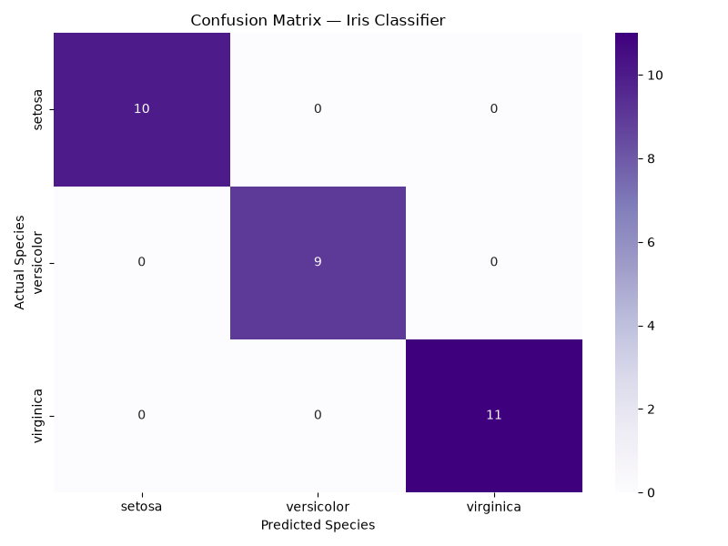

# 🌸 Iris Flower Classification

> Project 2 | DecodeLabs AI Internship — Batch 2026

---

## 📌 About

A supervised machine learning project that classifies
iris flowers into 3 species using the KNN algorithm.
Trained on the famous Iris dataset with 150 samples
and 4 features, achieving high accuracy with proper
evaluation metrics.

---

## ⚡ Features

- ✅ Loads and explores Iris dataset using Pandas
- ✅ Splits data 80/20 for fair model evaluation
- ✅ Scales features using StandardScaler
- ✅ Trains KNN classifier with K=5
- ✅ Evaluates using classification report & F1 score
- ✅ Visualizes results with confusion matrix

---

## 🛠️ Built With


---

## 🌸 Dataset

| Property | Value |
|----------|-------|
| Samples | 150 flowers |
| Classes | 3 (Setosa, Versicolor, Virginica) |
| Features | 4 (Sepal Length, Sepal Width, Petal Length, Petal Width) |
| Source | Scikit-learn built-in dataset |

---

## 🚀 How To Run

**1. Clone the repository**
```bash
git clone https://github.com/Tayyabakhalidd/iris-classification.git
```

**2. Install libraries**
```bash
pip install scikit-learn pandas numpy matplotlib seaborn
```

**3. Run the classifier**
```bash
python classifier.py
```

---

## 📊 Results



---

## 🧠 What I Learned

- Supervised machine learning pipeline
- KNN algorithm and how it works
- Feature scaling with StandardScaler
- Train-test split for fair evaluation
- Model evaluation with F1 score
- Data visualization with Seaborn

---

## 👩‍💻 Developer

**Tayyaba Khalid** — AI Engineer & Python Developer

[](https://linkedin.com/in/tayyabakhalidd)
[](https://tayyabakhalidd.netlify.app/)
